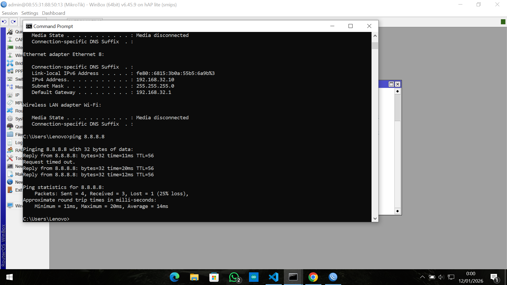

# Python Network Automation (Learning Project)

Repository ini berisi kumpulan script Python hasil proses belajar **network automation**, dengan fokus utama pada perangkat jaringan **MikroTik**.

Catatan:
Project ini **bukan project production** dan **bukan project jadi**.  
Repository ini dibuat sebagai **media belajar, latihan, dan dokumentasi progres pribadi**.

---

## Tujuan Repository

- Mempelajari Python untuk otomasi jaringan
- Memahami konsep remote access menggunakan SSH
- Melakukan konfigurasi MikroTik secara otomatis
- Melatih logika scripting, struktur program, dan error handling

---

## Materi yang Dipelajari

Beberapa topik yang dipelajari dalam repository ini antara lain:

- Python dasar untuk network automation
- SSH menggunakan library `paramiko`
- SCP untuk upload dan download file konfigurasi
- Ping dan pengecekan port
- Otomasi konfigurasi MikroTik, meliputi:
  - IP Address
  - DHCP Client dan DHCP Server
  - IP Pool
  - NAT (Masquerade)
  - Backup dan export konfigurasi

---

## Teknologi dan Library

- Python 3
- paramiko
- scp
- socket
- os
- time

---

## Hasil

